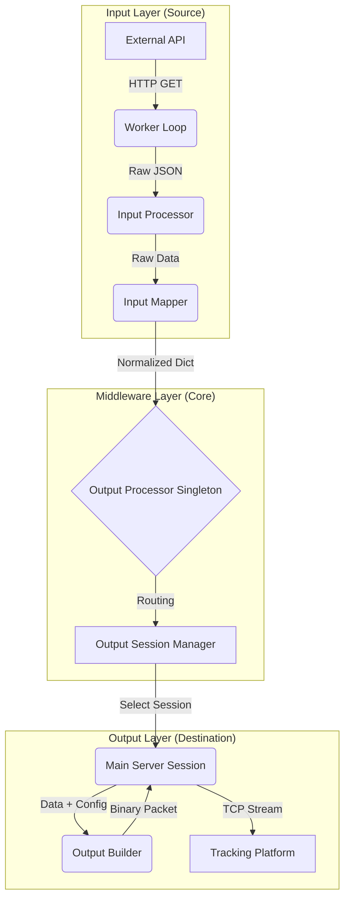

# HTTP-to-TCP Middleware (http2tcp-middleware)

**High-Reliability Telemetry Bridge & Protocol Converter**

This project is a robust, production-ready middleware designed to bridge the gap between modern HTTP-based IoT APIs and TCP-based tracking platforms. It represents an evolution in architecture, focusing on **thread safety**, **clean code principles**, **modularity**, and **traceability**.

While its predecessor (`communication-protocol-translator`) focused on direct socket translation, this middleware specializes in **fetching** data from external sources (HTTP/API), **normalizing** it, and **injecting** it into TCP streams as if it were a native device connection.

-----

## 🧠 Conceptual Architecture: How it Works

To understand this repository, you must visualize it as a **Pipeline of Abstraction**. The system moves data through three distinct layers:

1.  **Input Layer (Source Specific):** "Go get the data." (HTTP polling, WebSockets, etc.)
2.  **Normalization Layer (The Core):** "Make the data speak our language."
3.  **Output Layer (Protocol Specific):** "Send it to the server in their language." (TCP Packets)

### The Data Flow Pipeline



-----

## 🔍 Tracing the Flow: A Developer's Guide

If you are a developer trying to debug or extend this system, follow the "Life of a Packet" step-by-step:

### 1\. Initialization (`main.py`)

Everything starts here. The `main.py` is an orchestrator. It does not contain logic; it contains **configuration**.

  * It reads `settings.WORKERS_INPUT_SOURCE`.
  * It dynamically imports the modules specified (e.g., `app.src.input.mt02.worker`).
  * It spawns **Daemon Threads** for each worker.

### 2\. The Fetch (`app/src/input/<source>/worker.py`)

  * **Role:** The heartbeat of the input side. It runs an infinite loop.
  * **Logic:** It calls the `ApiClient` to get data.
  * **Intelligence:** It checks Redis to see if the data is *actually new* (deduplication) before processing.
  * **Next Step:** Passes data to `processor.process_location`.

### 3\. Normalization (`app/src/input/<source>/mapper.py`)

  * **Role:** The Translator.
  * **Logic:** This is where the specific external API format is converted into the **Internal Standard Dictionary**.
  * **Intelligence:** It handles odometer calculations (using Haversine logic via `app/src/input/utils.py` if the API doesn't provide it) and timezone corrections.
  * **Result:** A clean Python dictionary (`lat`, `lon`, `speed`, `voltage`, etc.) that the rest of the app understands.

### 4\. The Bridge (`app/src/session/output_session.py`)

  * **Role:** The Traffic Controller.
  * **Key Component:** `OutputProcessor` (Singleton).
  * **Logic:** The input layer calls `output_processor.forward()`. It doesn't know *how* or *where* the data goes, it just forwards it.
  * **Intelligence:** This component checks Redis to see which **Output Protocol** (e.g., GT06, Suntech) is assigned to this specific device.

### 5\. Session Management (`app/src/session/output_session.py`)

  * **Role:** The Connection Keeper. This is the most complex and robust part of the code.
  * **Key Class:** `MainServerSession`.
  * **Robustness:**
      * **Thread Safety:** Uses `threading.RLock()` to ensure that writing to the socket is safe even if multiple threads access it.
      * **State Machine:** Handles the connection lifecycle: `Connect` -\> `Login` (if protocol requires) -\> `Send Data` -\> `Heartbeat`.
      * **Auto-Recovery:** If the TCP connection drops, it handles reconnection seamlessly.

### 6\. The Build (`app/src/output/<protocol>/builder.py`)

  * **Role:** The Encoder.
  * **Logic:** Takes the **Internal Standard Dictionary** and uses `struct.pack` to convert Python data types into **Binary Byte Arrays** required by protocols like GT06.

-----

## 🛠️ Key Features & Engineering Decisions

### 1\. Dynamic Modularity

The system is designed so that `main.py` doesn't know which protocols exist until runtime.

  * **Input Sources** are loaded based on `settings.py`.
  * **Output Protocols** are loaded based on Redis configuration per device.
  * *Benefit:* You can add a new API integration without touching the core logic.

### 2\. Robust Threading Model

  * **Daemon Threads:** Workers run in the background.
  * **Locking (`threading.RLock`):** Critical in `output_session.py`. Since a device might send a heartbeat (timer thread) and a location packet (worker thread) simultaneously, locks prevent socket corruption.

### 3\. Smart Session Management (The `MainServerSession` Class)

Unlike simple scripts that open/close sockets per packet, this middleware maintains **Persistent TCP Connections**.

  * **Login Handshake:** It knows that protocols like GT06 need a Login Packet before sending data. It handles this state (`self._is_gt06_login_step`).
  * **Heartbeats:** It uses `threading.Timer` to keep the connection alive (keep-alive) if the API stops sending data for a while.

### 4\. Redis as State & Cache

Redis is not just a database here; it is the **Shared Memory**.

  * **Deduplication:** "Did we already process this timestamp?"
  * **Configuration:** "What output protocol does device X use?"
  * **Persistence:** "What was the last odometer reading?"

-----

## 🚀 How to Add a New Integration

### Adding a New Input Source (e.g., "Starlink API")

1.  Create folder `app/src/input/starlink`.
2.  Create `api_client.py` (Handling HTTP Auth/GET).
3.  Create `mapper.py` (Convert Starlink JSON -\> Internal Dict).
4.  Create `worker.py` (The loop that calls client -\> mapper -\> `output_processor.forward`).
5.  Register in `settings.WORKERS_INPUT_SOURCE`.

### Adding a New Output Protocol (e.g., "Coban")

1.  Create folder `app/src/output/coban`.
2.  Create `builder.py` (Functions to build Login/Location binary packets).
3.  Register in `app/src/output/output_mappers.py`.
4.  Add connection details in `settings.py`.

-----

## ⚙️ Configuration

Configuration is managed via `pydantic` in `app/config/settings.py` and environment variables (`.env`).

**Key Settings:**

  * `WORKERS_INPUT_SOURCE`: Dict defining which input modules to load.
  * `OUTPUT_PROTOCOL_HOST_ADRESSES`: Target TCP servers (IP/Port).
  * `REDIS_*`: Redis connection details.

-----

## 📦 Installation & Running

### Prerequisites

  * Python 3.11+
  * Redis Server running

### Setup

1.  Clone the repository.
2.  Create virtual env: `python -m venv venv` & `source venv/bin/activate`.
3.  Install dependencies: `pip install -r requirements.txt`.
4.  Copy `.env.example` to `.env` and configure.

### Running

```bash
python main.py
```

### Docker

```bash
docker build -t http2tcp-middleware .
docker run -d --env-file .env --network host http2tcp-middleware
```

-----

## 🛡️ License

Distributed under the Apache 2.0 License. See `LICENSE` for more information.